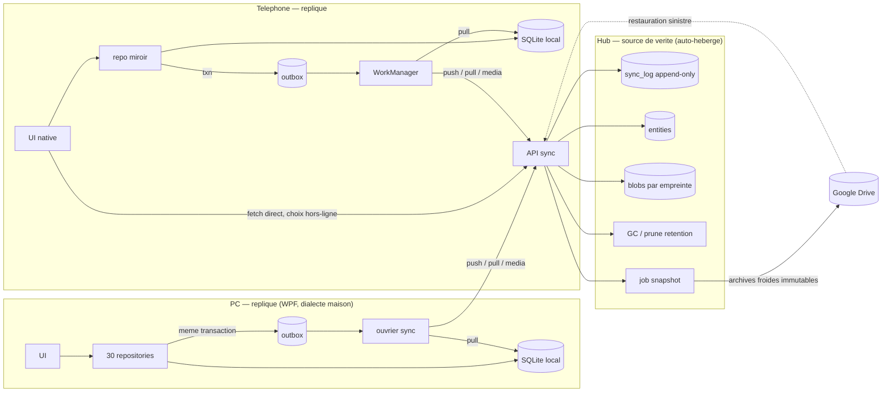

# Mobilité & synchronisation — dossier de conception (futur)

**État : idée de travail. Aucune ligne n'est écrite, aucun ticket n'est ouvert, aucune dépendance n'est ajoutée.**
Ce document fige les conclusions de la reflexion pour les reprendre plus tart sans avoir à la refaire. Il ne décrit pas l'app d'aujourd'hui, il décrit le chemin.

Derniére passe : 2026-09-23.

---

## 0. Les decisions déja prises

À ne pas rouvrir à chque relance du dossier.

| # | Decision | Effet |
|---|---|---|
| D1 | Pas de dépendance à un service externe pour le stockache des données | le Drive n'est **pas** la source de vérité. Il ne reçoit que des archives foides de restauration. Le hub est la seule autorité |
| D2 | Le téléhone va quérir directement au serveur | pas de relais par le PC. Le PC est une réplique parmi les répliques |
| D3 | La bibliothéquement de musique est tirée sur demande ; le hors-ligne est **choix par l'utilisataur** | pas de bascule automatique des 11,6 Go sur l'appareil. Un téléchargement sélectif, avec la liste des morçeaux gardés visible |
| D4 | Le sujet est pour plus tart | aucune modification du code existant n'est justifiée par ce dossier |

---

## 1. Le point de départ, mesuré

Volums réels lus dans le dépôt lé (`src/AkashicRecords.App/bin/Debug/net8.0-windows`), 2026-09-23. Pas des estimations.

| Posé | Volum | Nature | Devant le hub |
|---|---|---|---|
| `data/akashic.db` | **0,74 Mo** | texte, méta, organisation | oui : `entities` + `sync_log` (le texte seul) |
| `music/` | **11,6 Go** (2 046 fichiés) | audio | oui : blobs adressés par empreinte, une seule fois (dédupliquage par hash) |
| `media/` | **0,3 Mo** (5 fichiés) | images importées | oui : blobs |
| `config/` | négligeable | réglages + clés d'API tierces | **non** : les clés restent au hub ou au coffre local du PC, hors du contrat |
| `backups/` | 8,8 Go | copies histoiriques | **non** : cet volum s'évanoi avec l'adressage par empreinte |
| `tools/` | 330 Mo | yt-dlp / ffmpeg | non, re-téléchargeable |

Matiére vivante à héberger : **≈ 12,4 Go**, dont ~93 % d'audio immutable. Le goulet est le disque et la montante réseau, pas le CPU.

---

## 2. Pourquoi l'idée de départ ne tient pas telle quelle

L'idée premiére : un Drive Google portant le nécesaire, le PC rafraîchissant sa sauvegarde locale à intervalle, le téléhone se nourissant et alimentant le Drive en permanence.

**Poser le `akashic.db` vivand sur un Drive corrompt la base.** SQLite maintient des verroux et un journal WAL ; un client de Drive synchrone des fichiés entiers et ne connais ni l'atomecité d'une transaction, ni l'ordre des écritures. Deux machines qui écrivent produisent des copies divergentes que le client de Drive arbitre à l'aveugle. La perte est silencieue.

**Le « tout le temps connecté » n'existe pas sur mobile.** Android met l'app en veille (Doze) et bride le réseau en arrière-plan. Ce qui est atteignable est un travail périodique borné plus une relance à la reconnexion et à chaque écriture locale.

Le reste du dossier est la forme qui tient.

---

## 3. Architecture retenue — un hub de synchronisation



Le contrat : le hub est **la** vérité. Les appareils ne sont que des répliques qui poussent des intentions et tirent un delta. Drive n'intervient qu'à la restauration.

### Contrat d'entité

Quatres colonnes sur chque table portée par les dépôts de `src/AkashicRecords.Infrastructure/Persistence`, ajoutées par le mécanisme déja en place dans `SchemaInitializer.EnsureCreated` (`AddColumnIfMissing` + `PRAGMA table_info`) — pas de migration cassante, pas de refonte de schéma.

| Colonne | Rôle | Autorité |
|---|---|---|
| `Id` | identifiant stable émis par le client à la création, jamais réattribué | client, validé au hub |
| `Rev` | numéro de révision attribué **par le hub** à chaque commit accepté, croissant par entité | hub |
| `BaseRev` | révision que le client croyait lire en émettant | client, contrôlé au hub |
| `Deleted` | pierre tombale, conservée une fenêtre de rétention | hub |
| `LastDevice` | appareil auteur de la dernière mutation acceptée | hub |
| `UpdatedAt` | horodatage **d'affichage seulement** — jamais un critère d'ordre | hub |

```
sync_log(seq PK, entity_type, entity_id, rev, device_id,
         payload, deleted, committed_at)      -- append-only, source de verite
entities(entity_type, entity_id, rev, payload, deleted,
         updated_at, last_device) PK(entity_type, entity_id)
```

`payload` en JSON, `schemaVersion` par type d'entité, lecteur toérant (les champs s'ajoutent, aucun ne change de sémantique). Les POCOs de `AkashicRecords.Domain` (`Poem`, `Recueil`, `Recipe`, `Photo`, `MusicTrack`, `Playlist`, `JournalEntry`, `Artwork`, …) restent le modèle de référence et servent de base aux DTO du contrat.

### API du hub

| Endpoint | Effet |
|---|---|
| `POST /sync/push` | un lot de mutations ; accepté si `base_rev == rev` courante, sinon `conflict` avec l'état courant |
| `GET /sync/pull?since=<curseur>&limit=n` | les lignes du journal après le curseur, tombales comprises. Curseur = `seq` opaque, **jamais un horodatage** |
| `POST /media` | dépôt d'un blob, adressé par son empreinte SHA-256, immutable |
| `GET /media/{hash}` | téléchargement, cache-able par le client |
| `POST /auth/pair` | appairage par code à usage unique, jéton par appareil |
| `GET /snapshot` | instant complet, pour la resyncho quand le curseur d'un client est trop ancien |

Non négotiable :

- l'ordre vient du `seq`, pas des horloges — deux appareils dont l'horloge diverge ne peuvent pas permuter leurs mutations ;
- commit atomec : `sync_log` puis `entities` dans la même transaction — un arrêt en cours de commit ne laisse qu'une entrée absente du journal, donc invisible à tous, jamais un demi-état ;
- rétention des tombales ≥ fenêtre hors-ligne maximale. Un client absent plus longtemps que la rétention reprend par `snapshot`, pas par son curseur ;
- le GC des blobs (non-référencés + sous rétention) est un service du hub, sous un double plancher.

### Politique de conflit par domaine

Un seul réglage pour tous serait une faute : les domaines n'ont pas la même nature.

| Famille | Règle |
|---|---|
| Texte libre — `Poem.Title/Text/RichContent`, `Recipe.*`, `JournalEntry`, `Observation`, `Recueil.Summary` | dernier gagnant par champ, avec contrôlle de `BaseRev` ; fusion du texte si les deux versions dérivent d'une base commune et que les zones touchées sont disjointes |
| Collections d'identifiants — `PlaylistTrack`, `TrackMood`, `TransitionStep`, axes d'évaluation | ensembles : ajout gagnant, suppression par tombale |
| Graphes — `CanvasElement`, `CanvasConnector` | ajout gagnant ; **le hub valide l'intégrité référentielle au commit** — une arête dont un sommest est tombal est refusée avec compte-rendu, jamais insérée silencieusement |
| Réglages et positions — canevas, z-order, mise en forme du poème, volume, `Mood` | dernier gagnant par entité |
| Dérivés — comptes de poèmes par recueil, comptages d'étagère | **jamais stockés comme vérité**, recalculés depuis les entités vivantes |

### Chemin d'écriture local (PC et téléhone, même patron)

Les signatures des dépôts ne bougent pas. La mutation métier et l'inscription de l'intention dans l'outbox sont committées dans la **même** transaction SQLite : une coupure réseau ne peut pas perdre une saisie.

```
sync_outbox(seq PK, entity_type, entity_id, base_rev,
            payload, deleted, attempts, last_error)
sync_state(key PK, value)        -- curseur local, plantché de dernière resynchro
```

Un ouvrier de fond pousse l'outbox puis tire depuis le curseur et applique : `remote.rev > local.rev` ⇒ application ; tombale ⇒ suppression douce locale, retirée après le plantché de rétention.

Précédents dans le dépôt pour l'ouvrier périodique : `DispatcherTimer` avec `Interval` — 200 ms (debounce de recherche, `MainWindow`), 500 ms (`MusicPlayerWindow`), 3 s (`ArchivesView`). Même mécanique, intervalle plus long (de l'ordre de la minute), remis à zéro à chque action de l'utilisataur.

### Découpages induits, tous réversibles

- `Infrastructure/WindowsIntegration` (`GlobalHotkey` sur `user32.dll`, `StartupManager` sur le registre, `TrayIcon`/`NativeMethods` sur `shell32.dll`) derrière une interface `ISystemIntegration` avec implémentation nulle. Le `.csproj` porte déja le commentaire « only used internally for NotifyIcon/NativeWindow; never exposed in public APIs » : la cousture est en place, il reste à la nomer.
- `MediaStorage` devient un cache. Les colones de chemin local (`Poem.ImagePath`, chemins de `Photo`, `JournalPhoto`, `MusicTrack.FilePath`) gagnent un pendant `…Hash` ; le chemin ne vaut plus que comme position dans le cache. Les fichiés sont retéléchargeables, donc effaçables sous pression de disque.
- `MusicLibraryScanner` (qui balaie `<exe>/music`) : côté mobile, une requête de liste au hub plus un téléchargement sélectif (D3). Le `MediaPlayer` du dialecte reste PC ; Android lit le cache par un lecteur natif.
- `config.json` : les clés d'API tierces ne voyagent pas vers chque appareil. Réglages d'appareil locaux, secrets au hub ou au coffre du PC.
- `backup.ps1` (qui copie `data/`, `music/`, `media/`, `config/`) est rétrogradé en outil d'export ; il ne représente plus la sauvegarde de référence.

### Drive, réduit à son rôle sûr

Un job côté hub produit des archives foides : instant de `entities` + de `sync_log` en JSONL, plus les blobs par empreinte. Fichiés immutables, horodatés, versés dans Drive. Sert à restaurer un hub perdu, à consulter un état ancien. Ne reçoit jamais le `.db` vivand, n'est jamais la source du rafraîchissement.

---

## 4. Hardware

### Palier 1 — hub en service sur le PC existant. Zéro matériel nouveau.

Une machine qui compile une app .NET 8 WPF fait tourner un service HTTP + SQLite à ce volum sans s'en apercevoir. Suffisant pour les pas 1 à 3.
Limites : le téléhone ne synchrone pas quand le PC est éteint ; rien ne synchrone hors du réseau local.

### Palier 2 — nano-ordinateur à la maison.

Déclenché dès que « le PC éteint » ou « hors du réseau local » devient génant.

| Piéce | Coût environnant |
|---|---|
| Raspberry Pi 4 (2 Go) ou Pi 5 (4 Go), ou un mini-PC N100 (4 Go, 32 Go eMMC) | 45–90 € ; 120–180 € |
| SSD USB 240–500 Go (démarrage + base + blobs dessus) | 20–35 € |
| Câble Ethernet côté serveur (préférer au WiFi) | 3–8 € |
| Onduleur oualimentation continue (facultatif, protège l'instant) | 30–60 € |

**Piège à nommer : ne pas démarrer la machine sur une carte SD.** Les écritures répétées du WAL y consument l'usure. Le hub, sa base et ses blobs sur SSD.

Exposition réseau : pas de port ouvert sur la box, un tunel (WireGuard ou de ce type) piloté par le logiciel du fournisseur. Aucun surcoût matériel.

### Palier 3 — petit serveur loué.

Quand la synchro doit traverser deux réseaux distins sans dépendre de ce qui tourne dans la maison.

1 vCPU / 1–2 Go / **40–80 Go SSD** — 25 Go est trop étroit (12,4 Go de blobs + journal + rétention + staging d'instant). Environ 4–8 € par mois.
Variante : sortir l'audio du serveur (stockage objet ou Drive, retiré par empreinte) et n'y laisser que `entities` + `sync_log`, de l'ordre du Mo — un serveur d'entrée suffit lors.

Note de cohérence avec D1 : le palier 3 déplace la machine chez un tiers, pas les données — elles restent auto-gérées et exportables. Le tiers ne fait autorité sur rien.

### Dimensionement

| Ressource | Justification | Minimum conforable |
|---|---|---|
| CPU | mono-écrivain par entité, SQLite, ~2 000 blobs, aucune requête lourde | 1 cœr |
| RAM | HTTP mince + TLS + SQLite en WAL | 1 Go, 2 Go avec marge |
| Disque | 12,4 Go de blobs + journal append-only + staging d'instant ⇒ 2 à 3 fois le volum vivand | 60 Go, 120 Go conforables, SSD |
| Montante | le semis initial des 12,4 Go est l'évenement le plus cher ; ensuite des ko | ≥ 5 Mbit/s |
| Descente | le téléhone retélécharge en sélectif (D3) | sans contrainte |

### Le semis initial — le seul vraimoment long

Temps ≈ volum × 8 ÷ débit montante, une seule fois.

| Montante | 12,4 Go |
|---|---|
| 1 Mbit/s (ADSL bas) | ≈ 28 h |
| 5 Mbit/s | ≈ 5 h 40 |
| 20 Mbit/s | ≈ 1 h 25 |
| 200 Mbit/s (fibre) | ≈ 8 min |

Ensuite les deltas sont des ko par journée. L'audio ne pèse plus : un blob étant immutable, une piste ajoutée au catalogue n'envoie qu'une rangée de plus dans le journal, pas le fichié.

### Croissance du journal, bornée

Le texte seul y passe. À ~20 mutations de poème par jour sur deux appareils, payloads de quelques ko : ~40 rangées × 5 ko ≈ 200 ko/j ⇒ **~73 Mo par an**. L'audio n'y contribue pas. Le disque se dimansionne au rythme des médias importés, pas des éditions.

### Cache du téléhone

LRU de **1–2 Go**, téléchargement à la demande, plus la liste des morçeaux explicitement gardés hors-ligne (D3). Les 11,6 Go d'audio ne tiennent pas et ne doivent pas tenir.

---

## 5. Le Drive, coté honnêtement

Les 15 Go gratuits contre 12,4 Go de blobs uniques laissent ~2,6 Go, partagés avec tout le reste du compte. Trop fin pour être un dessein. Deux sorties :

- palier payant, ~2 To, ≈ 100 € par an ;
- **sortir l'audio du Drive** : la bibliothéquement se ré-construit depuis sa source, le Drive ne reçoit que le texte, les images et le journal (le `sync_log` JSONL de texte est de l'ordre du Mo ; ×30 conservés, quelques dizaines de Mo). Coûte rien, plus solide.

---

## 6. Coût récapitulé

| Scénario | Matériel | Abonement |
|---|---|---|
| Démarrage, palier 1 | 0 € | 0 € |
| Autonomie hors du PC éteint | 60–120 € (nano-PC + SSD + câble), + 30–60 € (onduleur) | 0 € |
| Traverser deux réseaux distins, en restant auto-géré | idem palier 2 | 0 € |
| Serveur loué | 0 € | 4–8 € / mois |
| Drive hébergeant aussi les médias | 0 € | ~100 € / an |
| Drive au texte seul (recommandation) | 0 € | 0 € |

---

## 7. Mise en place incrémentale, chque pas réversible

| Pas | Fait | Réers |
|---|---|---|
| 1 | Colonnes `Rev / BaseRev / Deleted / LastDevice` idempotentes via `AddColumnIfMissing` ; aucun lecteur affecté | drop des colonnes, sans effe sur l'app |
| 2 | Outbox local + application d'un delta ; hub simulé en bouchon, client unique | désactiver l'ouvrier, l'app ignore l'outbox |
| 3 | Hub réel, mono-appareil, puis co-loqué sur le PC en tant que service (le moins cher, « source de vérité » sans serveur distant) | retour au bouchon |
| 4 | Second client : mobile en lecture seule, puis en écriture ; `GET /media/{hash}` plus le cache LRU plus la liste des hors-ligne choisis (D2, D3) | lecture seule |
| 5 | Job d'instant vers Drive, restauration éprouvée sur une machine de test | supprimer le job |
| 6 | `backup.ps1` rétrogradé en export ; `config.json` scindé | conserver l'ancien script |

Branches depuis `dev`, commits `feat(sync): …` / `chore(sync): …`. Le merge d'une demande de revue reste fait par un humain.

---

## 8. Preuves à exiger avant de déclarer le montage foncionant

- **Idempotence** : pousser deux fois le même lot ne produit aucun effe.
- **Convergence** : après silence, toutes les répliques présentent le même état, quelque soit l'ordre de réception des deltas — proprété, pas un cas d'école.
- **Partition** : deux appareils éditent le même poème hors-ligne, puis se reconnectent dans un ordre aléatoire ; le résultat est le même, aucune ligne perdue.
- **Divergence d'horloges** : une machine dont l'horloge avance ou retarde de plusieurs heures ne peut pas inverser l'ordre des révisions.
- **Arrêt du hub en cours de commit** : rien d'observalement demi-écrit, aucune réplique ne reçoit de mutation orpheline.
- **Purge** : un blob supprimé pendant qu'une réplique hors-rétention le référençait encore est soit restitué, soit signalé — jamais remplacé par un autre contenu sous la même empreinte.
- **Hors-ligne choisi** : un morçeau marqué « gardé » reste lisible sans réseau ; un morçeau non marqué ne l'est pas et le dit clairement dans l'UI.

---

## 9. Quatre décisions à porter avant la première ligne

1. **Granularité de la fusion** — dernier gagnant par entité (simple, suffisant pour les usages les plus courants) ou par champ avec fusion de texte (plus juste, plus de code et de tests).
2. **Rétention** — durée hors-ligne admise pour un téléhone (7 j ? 30 j ?). Elle fixe la rétention des tombales, le volum du journal, la fréquence des instants Drive.
3. **Langage du hub** — ASP.NET mince (le `Domain` est réutilisable tel quel, un seul langage à trois bouts — le chemin le plus court) ou Node (légereté).
4. **Hébergement** — service sur le PC d'abord, puis nano-PC ou serveur distant. Le passage au distant est une étape, pas une renverse.

---

## 10. Pièges connus, déjà vérifiés dans ce dépôt

- Le dialecte UI (`System.Windows.*`, `MS.Win32.HwndWrapper`, `System.Windows.Interop.HwndTarget`, rendu `MediaContext`) est un runtime Win32 maison, pas le WPF officiel. **MAUI, Avalonia et Uno Platform ne sont pas des voies de portage ici** : ils portent le WPF/Microsoft UI officiel, pas ce dialecte. Toute UI mobile est à réécrire ; seule la logique métier se reporte.
- `Environment.SpecialFolder.ApplicationData` est utilisé pour les journaux et les caches (`App.xaml.cs`, `ImageSearchService.cs`), alors que la base vit dans `<exe>/data/akashic.db` (`SqliteConnectionFactory`). Deux racines distinctes à ne pas confondre en posant le cache mobile.
- `WindowsIntegration` est déja confiné et commenté comme tel dans `AkashicRecords.Infrastructure.csproj` : la séparation en `ISystemIntegration` est une nommage, pas une démolition.
- `SchemaInitializer` ne fait `CREATE TABLE IF NOT EXISTS` plus `AddColumnIfMissing` : il ne mute aucune table existante. Les colonnes de synchro doivent y être ajoutées par cette voie, pas par un `ALTER TABLE` volond.
- La capture headless (`--screenshot`) et la boucle d'ouvrier partagent `DispatcherTimer` : toute automatisation de la synchro doit rester remise à zéro par l'action de l'utilisataur, pour ne pas entrer en contention avec les timers déja en place.

---

## 11. Inconnues assumées

Aucune de ces questions n'a été tranchée, aucune réponse n'a été inventée.

- Nombre et volum des médias par appareil, et donc le plafond réaliste du cache mobile.
- Débit montante réel du site d'accueil (le tablemier du semis suppose des valeurs nominales).
- Consommation de la piste d'arrière-plan sur le modèle de téléhone visé, une fois le choix fait.
- Charge réelle du journal à un an, hors le régime de test de la section 4.
- Effet du quota de l'API Drive sur la fréquence des instants si le palier payant est retenu.
- Liste exacte des tables à synchroniser en premier : les 30 dépôts de `Persistence` ne sont pas tous des candidats évidents (`FilmOfTheDayService`, `GlobalSearchService`, `MusicLibraryScanner` sont dérivés ou locaux par nature).
